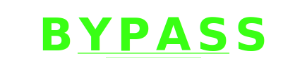
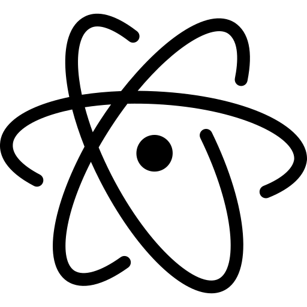
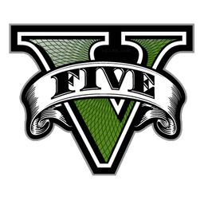

`ANDY-GGGG / README.md`

 

<!-- NOME ESTÁTICO -->

 

### Programador C++ | Engenheiro Reverso | Editor | Modelador 3D

 

**Diga não ao Python.**

 

<!-- TERMINAL STATUS -->

  

<!-- BLOCO DE SKILLS -->
   
 
   

  

---

###  Dashboard de Projetos

<table width="100%">
  <tr>
    <td width="50%" valign="top">
      <h4> LUAR RP</h4>
      
      
      
Portando o mapa completo e assets de alta fidelidade do <b>GTA V</b> para plataformas Mobile.

      <a href="https://site-jvyfnn288-andys-projects-9e308140.vercel.app/">Visualizar Site →</a>
    </td>
    <td width="50%" valign="top">
      <h4>⚡ Bypass Research</h4>
      
      
      
Desenvolvendo exploits e automações de baixo nível para sistemas educacionais do Paraná.

    </td>
  </tr>
  <tr>
    <td width="50%" valign="top">
      <h4>🦊 VULPES</h4>
      
      
      
Agência boutique focada em branding disruptivo, CGI e serviços de design para startups.

    </td>
    <td width="50%" valign="top">
      <h4>📂 Próximo Projeto</h4>
      
<i>Aguardando nova iniciativa de engenharia reversa ou desenvolvimento C++...</i>

    </td>
  </tr>
</table>

---

 

<!-- CONTADOR DE VISITAS MOE COUNTER -->

